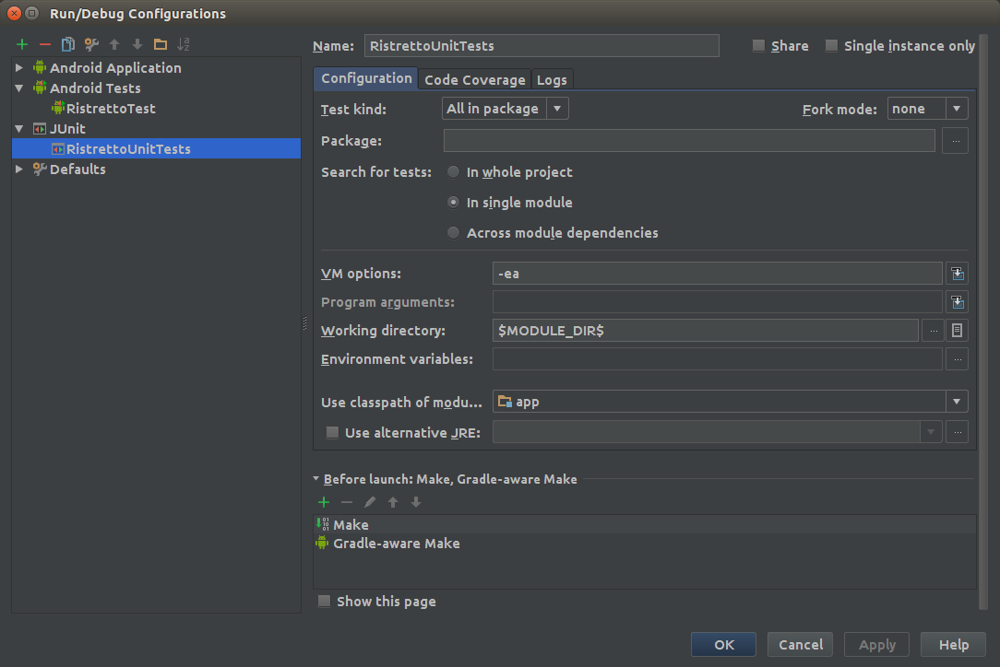
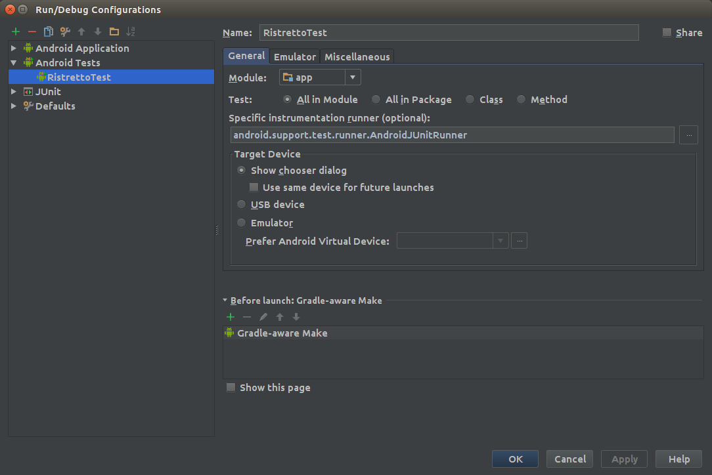

# RistrettoEspressoTest

Basic Espresso Hello World

To run the unit tests run `./gradlew test`

To run the functional tests, open an emulator of your choice and run `./gradlew cC`

To setup a run configuration for either set of tests edit the configurations in the following way:

Unit tests:

Funtional tests with espresso:

When you switch between the two sets of tests also remember to switch Test artifact in the Build Variants tab in Android studio.