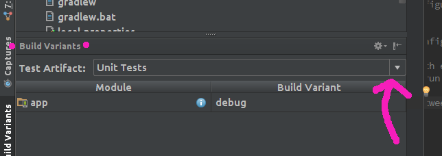

# RistrettoEspressoTest

Basic Espresso Hello World

Clone the project, import the project into Android Studio by choosing the build.gradle file.

To run the unit tests from the command line run `./gradlew test`

To run the functional tests from the command line, open an emulator of your choice and run `./gradlew cC`

To setup a run configuration in Android studio for either set of tests edit the configurations in the following way:

Unit tests:

Funtional tests with espresso:

When you switch between the two sets of tests also remember to switch Test artifact in the Build Variants tab in Android studio.

